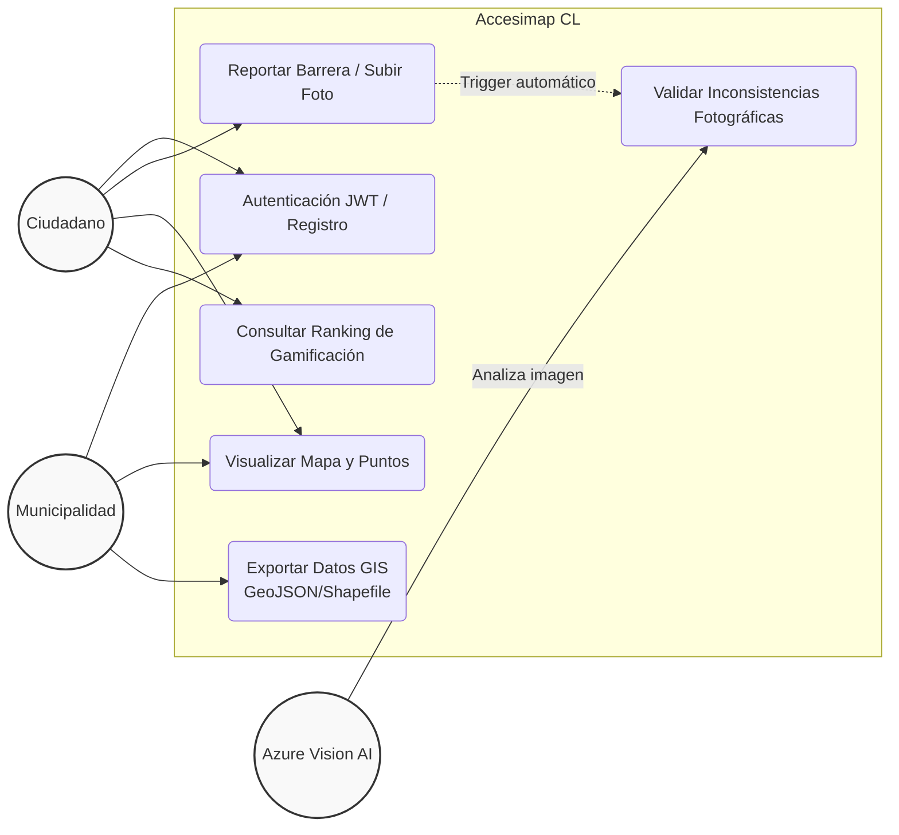
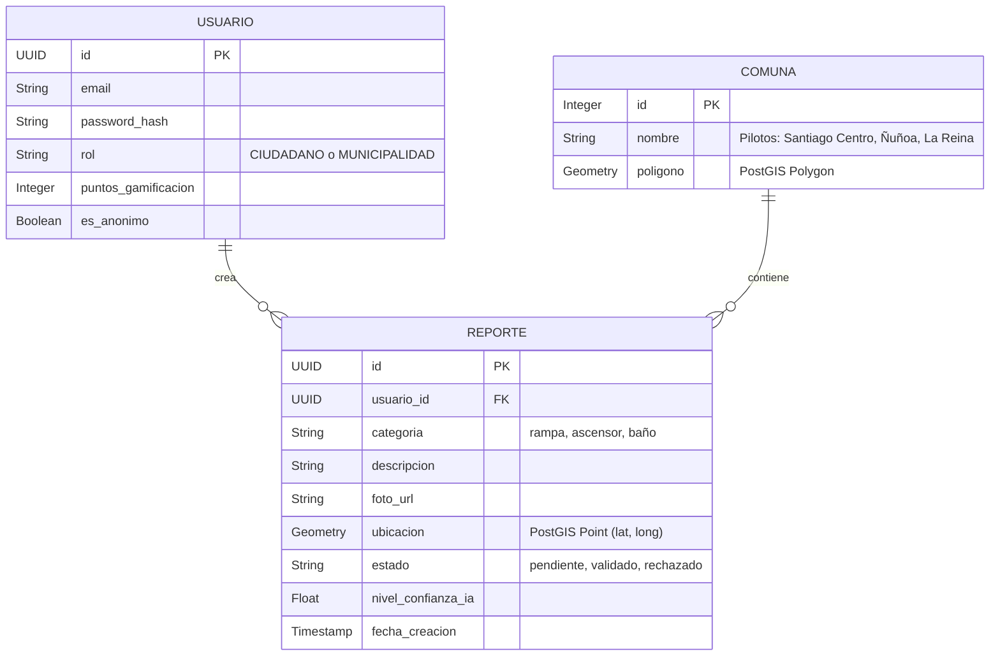
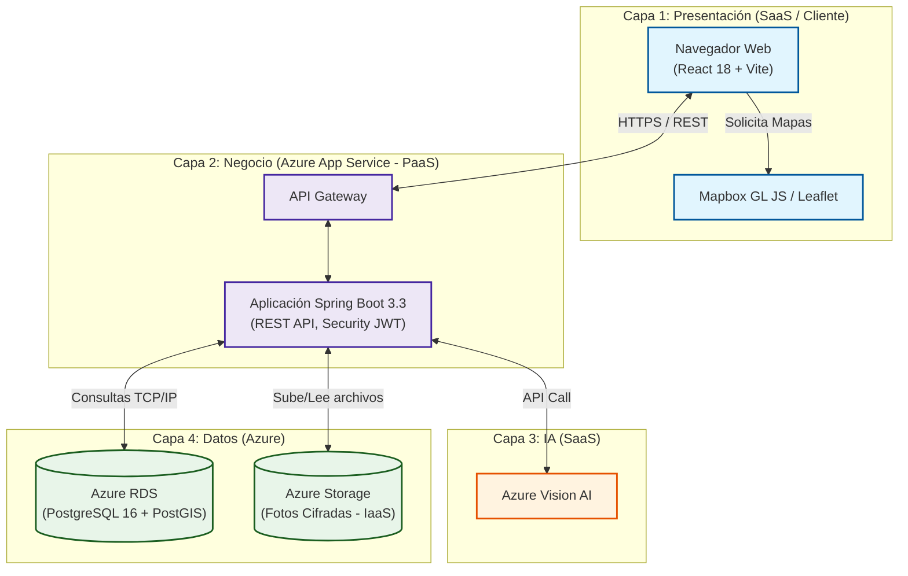
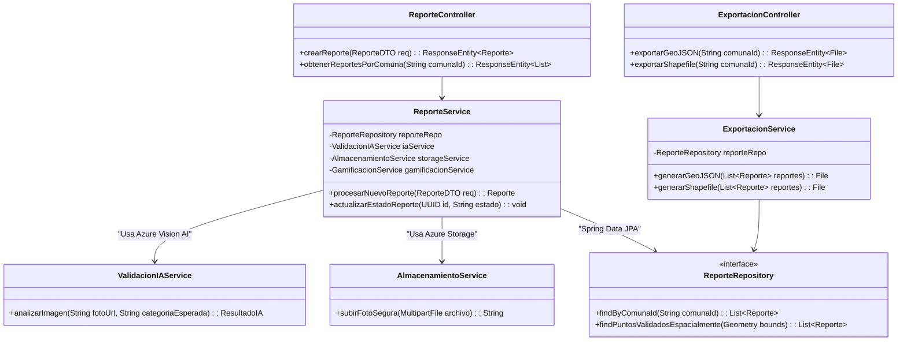
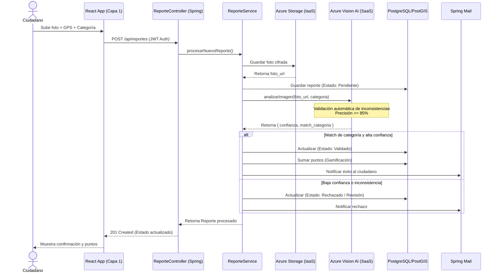
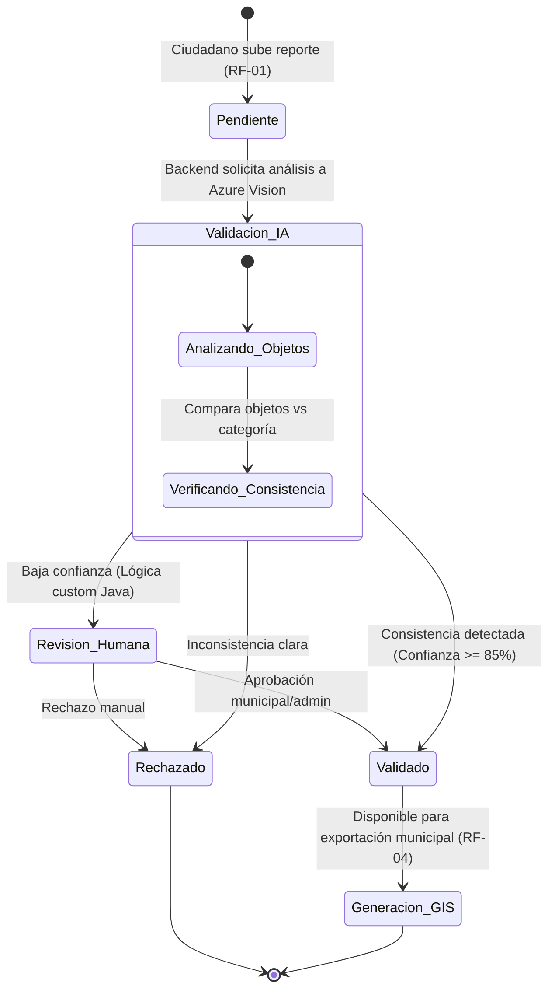

# Arquitectura del Proyecto - Sistema Accesimap CL

## 1. Visión General de la Infraestructura
 
La arquitectura de Accesimap CL se define como una **solución Cloud Nativa** distribuida en capas, apoyada enteramente en el ecosistema de Microsoft Azure (IaaS, PaaS y SaaS). El sistema adopta una arquitectura de **Monolito Modular** en el backend (Java/Spring Boot) desacoplado de un frontend interactivo en React.
 
1. **Hibridez de Servicios Cloud:** El sistema combina servicios gestionados (PaaS) para la lógica de negocio y base de datos relacional, infraestructura pura (IaaS) para el almacenamiento cifrado de archivos, y software como servicio (SaaS) para el procesamiento de Inteligencia Artificial.
 
2. **Separación Cliente-Servidor:** El frontend opera como una Single Page Application (SPA) independiente, comunicándose con el backend exclusivamente a través de una API RESTful segura.
 
### 1.1. Las Cuatro Capas Críticas
 
| Capa | Responsabilidad Principal |
|---|---|
| **Presentación (Frontend)** | Interacción ciudadana, captura de fotos/GPS, visualización cartográfica (Leaflet). |
| **Negocio / API (Backend)** | Lógica de gamificación, seguridad JWT, generación de archivos GIS. |
| **Inteligencia Artificial (SaaS)** | Análisis y detección de consistencia en fotografías geolocalizadas. |
| **Datos y Almacenamiento (IaaS/PaaS)** | Persistencia relacional geoespacial y almacenamiento cifrado de imágenes. |

---

## 2. Diagramas del Sistema (Mermaid)

### 2.1. Casos de Uso

2.2. Diagrama Entidad-Relación (Base de Datos)

2.3. Despliegue y Topología Cloud

2.4. Clases del Backend (Capa de Negocio)

2.5. Diagrama de Secuencia (Flujo Principal)

2.6. Diagrama de Estado (Ciclo del Reporte)


## 3. Capa de Ingesta y Presentación (Frontend)

El frontend de Accesimap CL es el punto de interacción tanto para el ciudadano que reporta como para la municipalidad que fiscaliza. Está construido sobre **React 18 con Vite**, asegurando tiempos de compilación rápidos y un empaquetado optimizado para despliegues en la nube.

### 3.1. Captura de Datos Ciudadanos (Crowdsourcing)

El flujo de reporte se ejecuta directamente en el navegador, con un enfoque *mobile-first* para facilitar su uso en la calle:

* **Captura Fotográfica:** El usuario puede subir una imagen desde su galería o tomar una fotografía en tiempo real utilizando la API nativa del navegador para acceder a la cámara del dispositivo.
* **Geolocalización:** El sistema consume la API de Geolocalización de HTML5. Al momento de capturar la foto, se extraen las coordenadas exactas (latitud y longitud) del dispositivo para asociarlas al reporte.
* **Categorización y Envío:** El usuario clasifica la barrera (rampa, ascensor, baño). El frontend empaqueta la imagen binaria y los metadatos (coordenadas, categoría, descripción) en un objeto `multipart/form-data` y lo envía mediante una petición `POST` segura al endpoint del backend.

### 3.2. Visualización Cartográfica

Para el panel municipal y la vista ciudadana, el mapa interactivo se renderiza utilizando **Leaflet.js** integrado con **Mapbox GL JS** como proveedor de mapas base (tilesets). 
Esta solución open-source es ligera, no incurre en los altos costos asociados a la API de Google Maps bajo tráfico intenso, y es ideal para superponer capas de puntos (marcadores) procesados desde la base de datos geoespacial (PostGIS).

---

## 4. Capa de Inteligencia Artificial (Validación Automática)

Para eliminar el cuello de botella que representa la revisión manual de cada fotografía y garantizar la calidad de los datos, Accesimap CL delega la validación primaria a un modelo de IA en la nube operando como SaaS.

### 4.1. Flujo de Validación con Azure Vision AI

El proceso de validación es sincrónico y se dispara automáticamente en el backend:

1.  El backend recibe la imagen enviada por el ciudadano.
2.  La imagen se envía a la API de **Azure Vision AI** (Image Analysis) mediante una llamada REST.
3.  El servicio retorna una lista de objetos detectados (tags) en la fotografía, junto con sus respectivos niveles de confianza (*confidence scores*).
4.  Un motor de reglas interno en Java compara estos objetos detectados con la categoría declarada por el usuario.
5.  Si la coincidencia tiene una confianza igual o superior al **85%**, el reporte transita automáticamente al estado `VALIDADO`, haciéndose visible en el mapa y otorgando puntos al usuario.
6.  Si la confianza es baja o existe una inconsistencia clara, el reporte se marca como `RECHAZADO` o `PENDIENTE DE REVISIÓN` humana.

---

## 5. Capa de Persistencia y Datos Geoespaciales

El sistema gestiona la información relacional y los archivos estáticos de forma separada, optimizando el rendimiento y los costos de almacenamiento.

### 5.1. PostgreSQL + PostGIS (Azure RDS)

Es la base de datos transaccional primaria del sistema, alojada como un servicio gestionado (PaaS). La decisión arquitectónica clave de esta capa es el uso de la extensión **PostGIS**.

* Las ubicaciones de los reportes se almacenan utilizando el tipo de dato nativo `Geometry(Point)`, no como simples columnas de latitud y longitud en formato flotante.
* Esto permite delegar cálculos espaciales complejos directamente a la base de datos (por ejemplo, `ST_Intersects` o `ST_Within` para buscar reportes dentro del polígono de una comuna específica), siendo drásticamente más eficiente que procesar coordenadas en memoria dentro de la aplicación Java.

### 5.2. Azure Storage (IaaS)

Para no degradar el rendimiento de la base de datos relacional, las fotografías pesadas nunca se guardan en PostgreSQL.

1.  Cada imagen subida se almacena en un contenedor privado de **Azure Blob Storage**.
2.  Los archivos están protegidos mediante cifrado en reposo y se transfieren vía HTTPS/TLS.
3.  La base de datos PostgreSQL almacena únicamente la URL de referencia (el *path*) hacia ese archivo en el Blob Storage.

---

## 6. Identidad, Autenticación y Roles (RBAC)

El núcleo de seguridad en el backend se implementa con **Spring Security** y **JSON Web Tokens (JWT)** para gestionar el control de acceso sin mantener estado en el servidor (stateless), lo que favorece la escalabilidad.

### 6.1. Control de Acceso Basado en Roles (RBAC)

El sistema implementa una matriz de permisos estricta basada en roles almacenados en la base de datos:

| Acción | Ciudadano (Autenticado) | Ciudadano (Anónimo) | Municipalidad | Administrador |
| :--- | :---: | :---: | :---: | :---: |
| Visualizar mapa y puntos | ✅ | ✅ | ✅ | ✅ |
| Subir reportes con foto | ✅ | ✅ | ❌ | ❌ |
| Acumular puntos (Gamificación) | ✅ | ❌ | ❌ | ❌ |
| Exportar datos GIS (Shapefile) | ❌ | ❌ | ✅ | ✅ |
| Moderar reportes "baja confianza" | ❌ | ❌ | ✅ | ✅ |
| Configurar parámetros del sistema | ❌ | ❌ | ❌ | ✅ |

---

## 7. Exportación GIS y Cumplimiento Normativo

La capacidad de exportar datos procesables para los departamentos de urbanismo municipal es el valor diferencial del proyecto y lo que permite apoyar el cumplimiento de la Ley 20.422.

El endpoint `/api/export/{comunaId}` procesa bajo demanda los datos validados alojados en PostGIS. Utilizando bibliotecas espaciales de Java (como GeoTools o equivalentes), el backend empaqueta las entidades geográficas en dos formatos estándar de la industria:

* **GeoJSON:** Formato basado en texto, ideal para integraciones web y APIs ligeras.
* **Shapefile (.shp):** Estándar de la industria GIS, listo para ser importado directamente en software de planificación urbana (como QGIS o ArcGIS) para cruzarlo con datos de obras públicas o catastro.

---

## 8. Patrón Arquitectónico: Monolito Modular en Capas

Dado el estricto plazo de desarrollo de 4 semanas, se descarta una arquitectura inicial de microservicios distribuidos, ya que introduciría una complejidad de despliegue y orquestación innecesaria para un MVP.

En su lugar, el backend Java se organiza como un **Monolito Modular** estructurado en el clásico patrón MVC (Model-View-Controller) en 4 capas. Esta arquitectura mantiene la velocidad de desarrollo y despliegue de un monolito, pero su diseño interno por dominios de negocio (módulos) prepara el terreno para una futura extracción a microservicios sin necesidad de reescribir el código base.

* `Módulo reportes`: Gestión de la API REST, subida de fotos y persistencia de barreras arquitectónicas.
* `Módulo validacion`: Aislamiento total de la lógica de comunicación con Azure Vision AI.
* `Módulo gamificacion`: Reglas de negocio para puntos, rankings y recompensas.
* `Módulo gis`: Conversión de entidades relacionales a formatos geográficos exportables.

---

## 9. Patrones de Diseño Backend (Java / Spring)

Para mantener el código limpio y cumplir con los requerimientos, se aplican los siguientes patrones de diseño de software (GoF):

* **Facade (Fachada):** Aplicado en la integración con Azure Vision AI. Una clase `AzureVisionFacade` envuelve el SDK de Microsoft, ocultando la complejidad de la autenticación y las llamadas HTTP, exponiendo al servicio principal solo un método limpio como `analizarImagen(foto)`.
* **Strategy (Estrategia):** Utilizado en el motor de validación. Permite cambiar dinámicamente cómo se evalúa un reporte (validación por IA vs. validación manual municipal) sin llenar el servicio principal de sentencias condicionales `if/else` rígidas.
* **Data Transfer Object (DTO):** Los controladores REST consumen y retornan exclusivamente DTOs (ej. `ReporteRequestDTO`, `MapaResponseDTO`). Las entidades `@Entity` de JPA nunca tocan la capa de red. Esto previene vulnerabilidades de *Over-Posting* y controla exactamente qué datos se exponen al frontend.
* **Repository:** Capa DAL (Data Access Layer) provista nativamente por Spring Data JPA, que abstrae las sentencias SQL complejas de PostGIS, exponiendo métodos semánticos listos para usar (ej. `findByPoligonoIntersects`).

---

## 10. Decisiones de Diseño y Justificaciones (ADR)

Registro de Decisiones Arquitectónicas (Architecture Decision Records) tomadas durante la fase de conceptualización:

| # | Decisión | Justificación y Alternativas |
| :--- | :--- | :--- |
| **ADR-001** | **Java 17 + Spring Boot 3.3** | Requisito obligatorio de la asignatura, pero fuertemente alineado con los estándares corporativos modernos. La versión 17 garantiza soporte LTS (Long-Term Support). |
| **ADR-002** | **Azure como proveedor Cloud único** | Se eligió sobre AWS o GCP porque el plan "Free Tier" de Azure para estudiantes/startups incluye créditos y capas gratuitas que cubren base de datos, almacenamiento web y APIs cognitivas (Vision AI) bajo un mismo ecosistema unificado. |
| **ADR-003** | **PostgreSQL + PostGIS (vs. MongoDB)** | Aunque las bases NoSQL son muy populares para MVPs rápidos, los datos GIS requieren relaciones espaciales fuertes. PostGIS es el estándar mundial de código abierto para cálculos geográficos, muy superior a las capacidades geoespaciales básicas de MongoDB. |
| **ADR-004** | **Leaflet.js (vs. Google Maps API)** | La API de Google Maps incurre en costos bajo tráfico moderado-alto. Leaflet.js es open-source, 100% gratuito, y se integra de forma nativa con archivos GeoJSON generados por el backend. |

---

## 11. Variables de Entorno Requeridas

El sistema sigue la metodología *12-Factor App*, exigiendo la inyección de la configuración a través de variables de entorno. **Ninguna de estas claves debe versionarse en el código fuente (GitHub).**

```bash
# ─── Base de Datos (PostgreSQL Azure RDS) ─────────────────────────
SPRING_DATASOURCE_URL="jdbc:postgresql://<host>:<port>/<dbname>"
SPRING_DATASOURCE_USERNAME="<db_user>"
SPRING_DATASOURCE_PASSWORD="<db_password>"

# ─── Seguridad (Spring Security / JWT) ──────────────────────────────
JWT_SECRET_KEY="<clave_super_secreta_generada_con_alta_entropia>"
JWT_EXPIRATION_TIME="86400000" # Tiempo en milisegundos (ej. 24 horas)

# ─── Azure Storage (Imágenes) ───────────────────────────────────────
AZURE_STORAGE_CONNECTION_STRING="DefaultEndpointsProtocol=https;AccountName=<name>;AccountKey=<key>;EndpointSuffix=core.windows.net"
AZURE_STORAGE_CONTAINER_NAME="accesimap-fotos"

# ─── Azure Vision AI (Validación) ───────────────────────────────────
AZURE_VISION_ENDPOINT="https://<region>[.api.cognitive.microsoft.com/](https://.api.cognitive.microsoft.com/)"
AZURE_VISION_SUBSCRIPTION_KEY="<api_key>"

```

## 12. Flujo de Trabajo Git (GitFlow Simplificado)

Para un equipo de 3 desarrolladores operando bajo el marco de trabajo Scrum con entregas (sprints) de 1 semana, se aplica un flujo de ramas estructurado para separar el desarrollo activo del código de producción:

* **`main`:** Rama protegida que refleja el código estable en producción. Solo recibe *merges* tras haber superado todas las pruebas y revisiones (cumplimiento del Definition of Done).
* **`develop`:** Rama principal de integración continua. Todo el equipo integra sus funcionalidades aquí. El código en esta rama debe compilar siempre y pasar las pruebas unitarias básicas.
* **`feature/[nombre]`:** Ramas de vida corta creadas a partir de `develop` para abordar tareas específicas del Backlog (ej. `feature/integracion-vision-ai`, `feature/dashboard-mapa`). Una vez terminada la tarea, se fusionan de vuelta a `develop` mediante un *Pull Request* (PR) para facilitar la revisión de código.
* **`hotfix/[nombre]`:** (Opcional pero recomendado) Ramas exclusivas para corregir errores críticos detectados en producción. Se desprenden de `main` y se fusionan de vuelta tanto en `main` como en `develop` para no perder la corrección en futuros despliegues.

---

## 13. Plataforma de Despliegue (Azure Free Tier)

Para cumplir estrictamente con el requerimiento no funcional RNF-11 (Costo $0 USD), la arquitectura se despliega separando físicamente el frontend del backend, aprovechando el ecosistema de servicios gestionados gratuitos de Microsoft Azure:

### 13.1. Frontend (Capa de Presentación)
* **Servicio:** Azure Static Web Apps (Plan Gratuito).
* **Despliegue:** Se configura un pipeline de CI/CD nativo mediante **GitHub Actions**. Cada vez que se hace un *push* o *merge* a la rama `main`, GitHub compila la aplicación React 18 (Vite) y redespliega los archivos estáticos en la nube de forma automática.

### 13.2. Backend (Capa de Negocio y API)
* **Servicio:** Azure App Service (Plan de tarifa F1 - Gratis).
* **Despliegue:** Actúa como el contenedor lógico de la API REST desarrollada en Spring Boot (Java 17). Gestiona toda la seguridad (JWT), la conexión con la base de datos y la orquestación con la inteligencia artificial.

### 13.3. Base de Datos (Capa de Datos Geoespaciales)
* **Servicio:** Azure Database for PostgreSQL - Flexible Server.
* **Configuración:** Utiliza la capa gratuita (B1ms) disponible por 12 meses para cuentas nuevas/estudiantiles. Permite instalar la extensión **PostGIS**, la cual es un requisito técnico indispensable para manejar los puntos geolocalizados y las consultas espaciales del mapa.

### 13.4. Almacenamiento de Archivos (Capa IaaS)
* **Servicio:** Azure Blob Storage.
* **Configuración:** Contenedor privado cifrado en reposo para guardar las fotografías subidas por los ciudadanos de manera segura. Al backend solo retorna las URLs de acceso temporal.

### 13.5. Inteligencia Artificial (Capa SaaS)
* **Servicio:** Azure AI Vision.
* **Configuración:** Se utiliza el plan gratuito (F0), el cual permite hasta 20 transacciones por minuto y 5.000 transacciones al mes. Esta capacidad es ideal y suficiente para cubrir la fase piloto y las pruebas del sistema en las 3 comunas designadas.

### 13.6. Monitoreo y Trazabilidad
* **Servicio:** Azure Monitor (Application Insights).
* **Configuración:** Se integra al backend de Spring Boot para centralizar los logs, registrar posibles excepciones de código y, críticamente, vigilar la telemetría para asegurar que el procesamiento de imágenes por la IA se mantenga en tiempos de respuesta de ≤ 5 segundos (RNF-02).