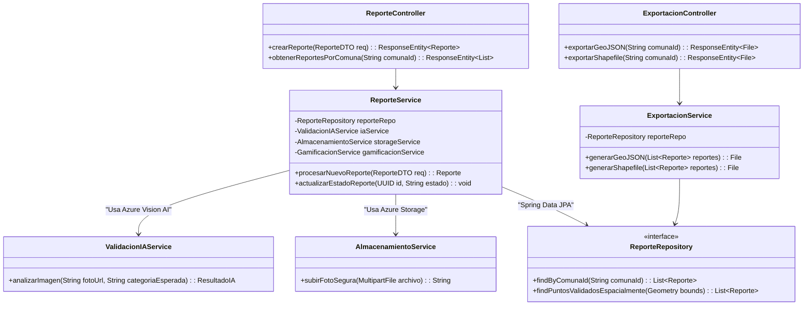

```mermaid
    classDiagram
        class ReporteController {
            +crearReporte(ReporteDTO req): ResponseEntity~Reporte~
            +obtenerReportesPorComuna(String comunaId): ResponseEntity~List~
        }

        class ExportacionController {
            +exportarGeoJSON(String comunaId): ResponseEntity~File~
            +exportarShapefile(String comunaId): ResponseEntity~File~
        }

        class ReporteService {
            -ReporteRepository reporteRepo
            -ValidacionIAService iaService
            -AlmacenamientoService storageService
            -GamificacionService gamificacionService
            +procesarNuevoReporte(ReporteDTO req): Reporte
            +actualizarEstadoReporte(UUID id, String estado): void
        }

        class ValidacionIAService {
            +analizarImagen(String fotoUrl, String categoriaEsperada): ResultadoIA
        }

        class AlmacenamientoService {
            +subirFotoSegura(MultipartFile archivo): String
        }
        
        class ExportacionService {
            -ReporteRepository reporteRepo
            +generarGeoJSON(List~Reporte~ reportes): File
            +generarShapefile(List~Reporte~ reportes): File
        }

        class ReporteRepository {
            <<interface>>
            +findByComunaId(String comunaId): List~Reporte~
            +findPuntosValidadosEspacialmente(Geometry bounds): List~Reporte~
        }

        ReporteController --> ReporteService
        ExportacionController --> ExportacionService
        ReporteService --> ValidacionIAService : "Usa Azure Vision AI"
        ReporteService --> AlmacenamientoService : "Usa Azure Storage"
        ReporteService --> ReporteRepository : "Spring Data JPA"
        ExportacionService --> ReporteRepository
```