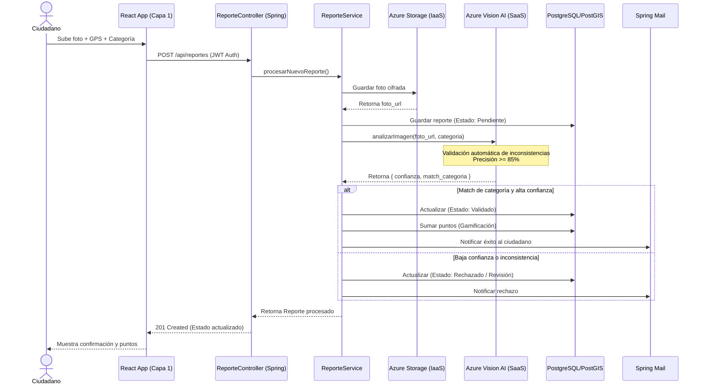

```mermaid
    sequenceDiagram
        actor Ciudadano
        participant Frontend as React App (Capa 1)
        participant API as ReporteController (Spring)
        participant Service as ReporteService
        participant Storage as Azure Storage (IaaS)
        participant IA as Azure Vision AI (SaaS)
        participant DB as PostgreSQL/PostGIS
        participant Mail as Spring Mail

        Ciudadano->>Frontend: Sube foto + GPS + Categoría
        Frontend->>API: POST /api/reportes (JWT Auth)
        API->>Service: procesarNuevoReporte()
        
        Service->>Storage: Guardar foto cifrada
        Storage-->>Service: Retorna foto_url
        
        Service->>DB: Guardar reporte (Estado: Pendiente)
        
        Service->>IA: analizarImagen(foto_url, categoria)
        Note over IA: Validación automática de inconsistencias<br/>Precisión >= 85%
        IA-->>Service: Retorna { confianza, match_categoria }
        
        alt Match de categoría y alta confianza
            Service->>DB: Actualizar (Estado: Validado)
            Service->>DB: Sumar puntos (Gamificación)
            Service->>Mail: Notificar éxito al ciudadano
        else Baja confianza o inconsistencia
            Service->>DB: Actualizar (Estado: Rechazado / Revisión)
            Service->>Mail: Notificar rechazo
        end
        
        Service-->>API: Retorna Reporte procesado
        API-->>Frontend: 201 Created (Estado actualizado)
        Frontend-->>Ciudadano: Muestra confirmación y puntos
```