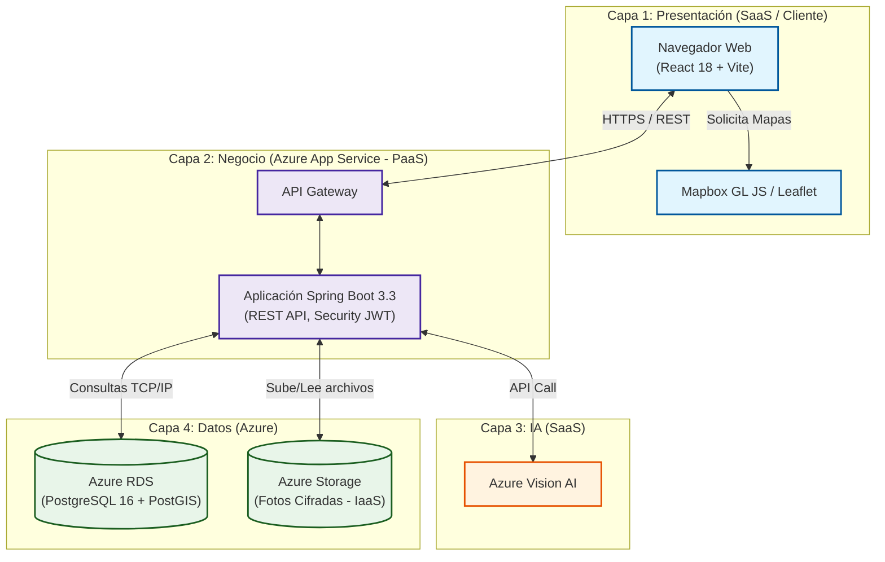

```mermaid
    flowchart TD
        %% Nodos de Cliente
        subgraph Capa_Presentacion ["Capa 1: Presentación (SaaS / Cliente)"]
            Browser["Navegador Web\n(React 18 + Vite)"]
            MapBox["Mapbox GL JS / Leaflet"]
        end

        %% Nodos de Backend / PaaS
        subgraph Capa_Negocio ["Capa 2: Negocio (Azure App Service - PaaS)"]
            Gateway["API Gateway"]
            SpringApp["Aplicación Spring Boot 3.3\n(REST API, Security JWT)"]
        end

        %% Servicios SaaS de terceros
        subgraph Capa_IA ["Capa 3: IA (SaaS)"]
            VisionAI["Azure Vision AI"]
        end

        %% Nodos de Datos / IaaS & PaaS
        subgraph Capa_Datos ["Capa 4: Datos (Azure)"]
            RDS[("Azure RDS\n(PostgreSQL 16 + PostGIS)")]
            Storage[("Azure Storage\n(Fotos Cifradas - IaaS)")]
        end

        %% Conexiones e integraciones
        Browser <-->|HTTPS / REST| Gateway
        Browser -->|Solicita Mapas| MapBox
        Gateway <--> SpringApp
        
        SpringApp <-->|Consultas TCP/IP | RDS
        SpringApp <-->|Sube/Lee archivos | Storage
        SpringApp <-->|API Call | VisionAI

        %% Estilos visuales
        classDef client fill:#e1f5fe,stroke:#01579b,stroke-width:2px;
        classDef backend fill:#ede7f6,stroke:#4527a0,stroke-width:2px;
        classDef database fill:#e8f5e9,stroke:#1b5e20,stroke-width:2px;
        classDef external fill:#fff3e0,stroke:#e65100,stroke-width:2px;

        class Browser,MapBox client;
        class Gateway,SpringApp backend;
        class RDS,Storage database;
        class VisionAI external;
```