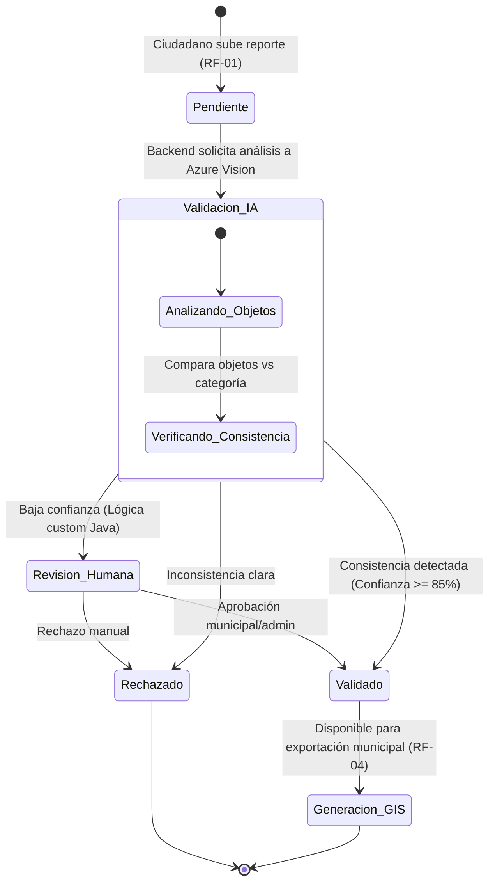

```mermaid
    stateDiagram-v2
        [*] --> Pendiente : Ciudadano sube reporte (RF-01)
        
        Pendiente --> Validacion_IA : Backend solicita análisis a Azure Vision
        
        state Validacion_IA {
            [*] --> Analizando_Objetos
            Analizando_Objetos --> Verificando_Consistencia : Compara objetos vs categoría
        }
        
        Validacion_IA --> Validado : Consistencia detectada (Confianza >= 85%)
        Validacion_IA --> Rechazado : Inconsistencia clara
        Validacion_IA --> Revision_Humana : Baja confianza (Lógica custom Java)
        
        Revision_Humana --> Validado : Aprobación municipal/admin
        Revision_Humana --> Rechazado : Rechazo manual
        
        Validado --> Generacion_GIS : Disponible para exportación municipal (RF-04)
        Rechazado --> [*]
        Generacion_GIS --> [*]
```